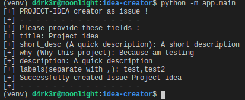
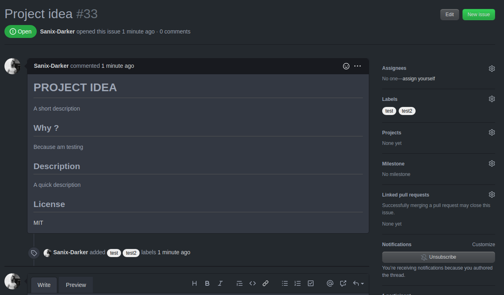

# Idea-Creator-bot

This is a simple bot that will take as input a title and a description then automatically create an issue Well formatted !

## Requirements

- python (3.x recommended)
- requests
- configparser

## How to install

```shell
# install virtual environment
virtualenv -p python3 venv
source venv/bin/activate

# install requirements
pip install -r requirements.txt
```

## How to test

Just hit :
```shell
python -m app.main
```

## Some screenshots

- The test on command line :


- The issue will be create directly :


- With this scructure :


## License
[MIT](https://choosealicense.com/licenses/mit/)
