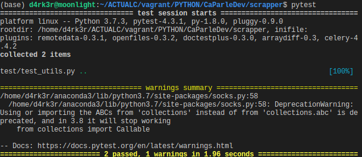

# CaParleDev-Scraper

A scrapper tool for devs users in Cameroun/Cameroon location.

### Project Branches structure

- Branches structure :
```shell
.
├── master
│   ├── dev
│   |    ├── backend/feature/dev/feature-name1
│   |    ├── frontend/feature/dev/feature-name2
|   |    |    └── frontend/fix/dev/fix-name1
│   |    ├── mobile/feature/dev/feature-name3
|   |    |    ├── mobile/fix/dev/fix-name4
|   |    |    └── mobile/fix/dev/fix-name5
......
```

### How to test

- To run tests, you just have to hit `pytest`.


### Contribution workflow

- Create an issue with your feature/improvement (Optionnal but recommended).
- Fork the project.
- Create a branch for your feature/update/fix(Make sure to have the latest master-branch updates).
- Create a Pull Request to dev branch.
- After a check, it will be verify and merge to the project.
