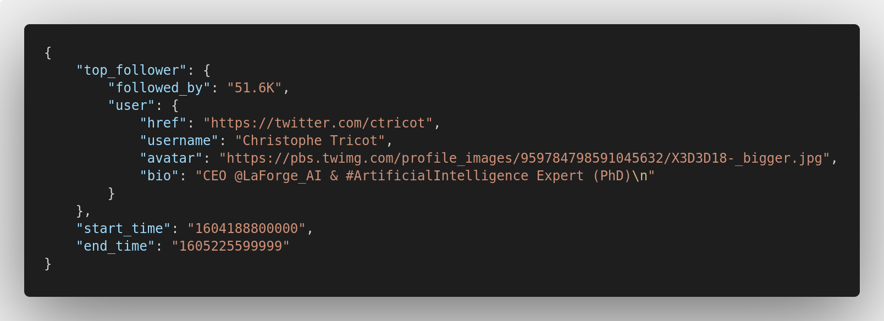
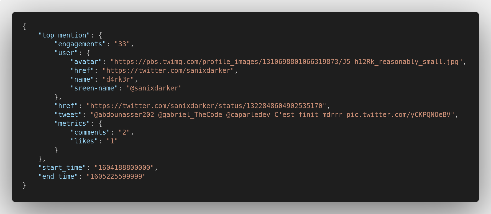

# Twitter-Scraper

## Requirements

- Python (3.x recommended)


### How to install

- Set up your virtualenv : 
```shell
virtualenv -p python3 venv
# activate it
source venv/bin/activate
```

- Install requirements :
```shell
pip install -r requirements.txt
```


### How to launch

- You just have to run the scrapper with this command :
```shell
python -m app.main
```


## Output

- The Output of Summary scrapping


- The Output of Top-Follower


- The Output of Top-Mention

